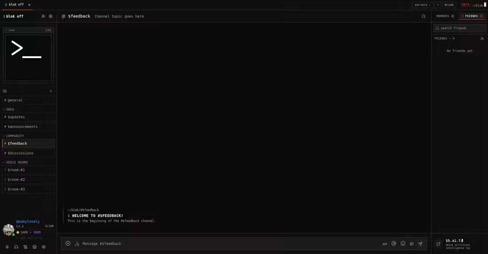
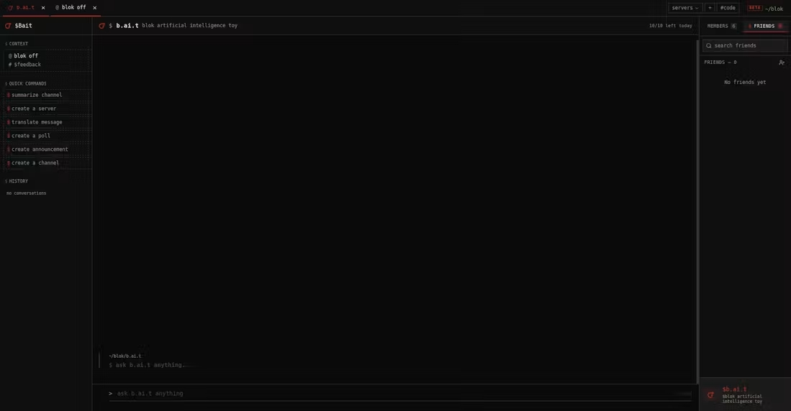
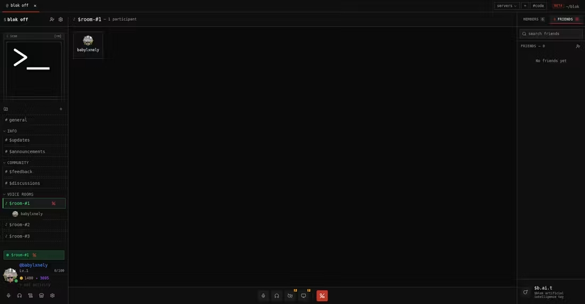
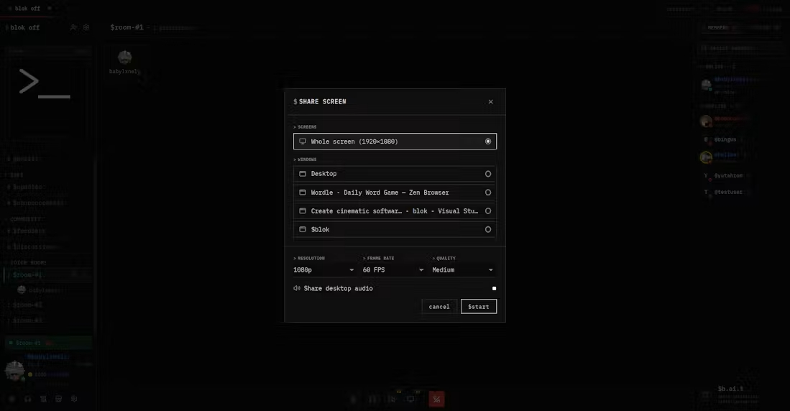
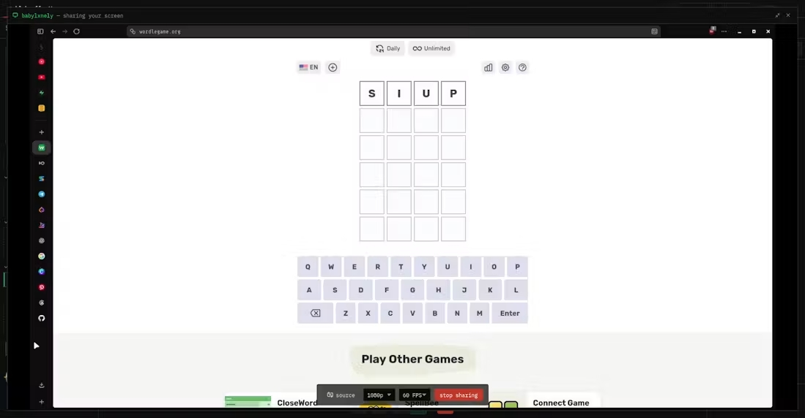
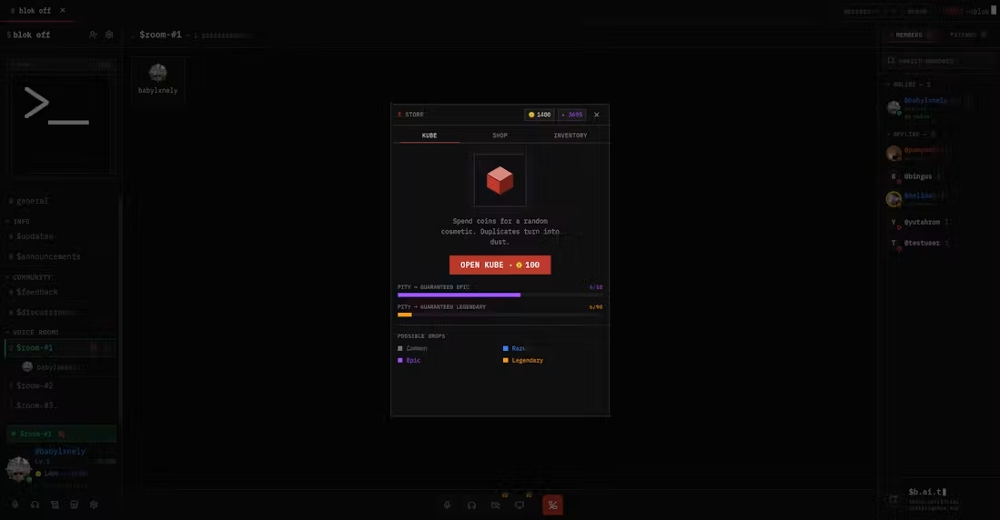
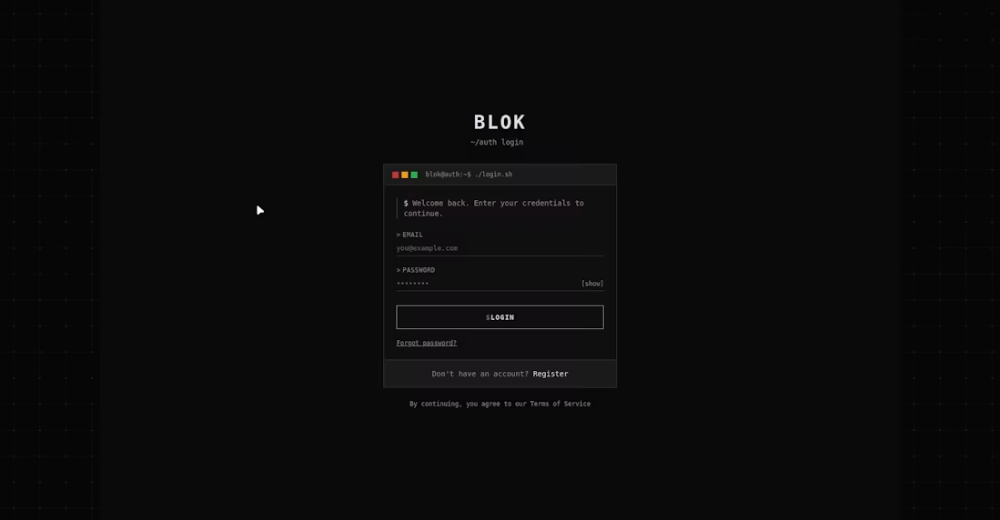

<div align="center">

# blok

**A native desktop chat platform — like Discord, but yours.**
Voice, video & screen share over a Rust P2P core, an AI that runs your server, and a loot-box economy.

[](https://github.com/pompei1i/blok-releases/releases/latest)
[](#install)
[](LICENSE)
[](https://tauri.app)
[](https://github.com/pompei1i/blok/discussions)

🧪 **Public beta.** Text and voice are stable; screen share and video are experimental.



</div>

---

## What it is

blok is a self-contained community platform that runs on **your** Supabase project. There is
no blok company in the middle: the desktop app talks to your database directly, and voice
and video go **peer-to-peer** through a native Rust WebRTC core — media never touches a
server. Fork it, point it at your own backend, and it's yours.

It started as "a Discord I actually control" and grew a personality: a terminal-styled UI,
an AI assistant that can build channels and roles for you, and an XP/loot-box economy that
makes a chat feel like a place rather than a log.

## Install

**Download it, make an account, you're in.** The installers below are built against the
project's own backend — that's what "public beta" means here — so there's nothing to
configure, host, or sign up for anywhere else. It's free, and there is nothing to buy.

| Platform | File |
|---|---|
| Windows 10/11 | `blok_x.y.z_x64-setup.exe` |
| Debian / Ubuntu / Mint | `blok_x.y.z_amd64.deb` |
| Fedora / RHEL | `blok-x.y.z-1.x86_64.rpm` |
| Any Linux | `blok_x.y.z_amd64.AppImage` |

Grab one from the [latest release](https://github.com/pompei1i/blok-releases/releases/latest).
Installed clients keep themselves up to date through the signed Tauri updater.

> 🚀 **First time here?** → **[Getting started](docs/GETTING_STARTED.md)** walks you from
> download to talking to your friends in about five minutes.
> Then: **[User guide](docs/USER_GUIDE.md)** · **[FAQ](docs/FAQ.md)** · **[Troubleshooting](docs/TROUBLESHOOTING.md)**

Want it on infrastructure you control instead? → **[Self-hosting guide](docs/SELF_HOSTING.md)**

## Features

- 🤖 **b.ai.t — an AI that acts.** Not a chatbot bolted on the side: it creates servers,
  channels, categories, roles and polls, writes announcements, summarizes a channel and
  sets timers — through tool calls, from inside the chat. The API key lives server-side in
  an Edge Function; nothing sensitive ships in the client. Capped at 10 prompts per account
  per day during the beta.
- 🌍 **Realtime translation.** Turn it on once and messages in other languages arrive in
  yours, in every chat, with "show original" one click away. Translations are cached per
  message and shared across everyone in the channel, and messages already in your language
  are skipped before any network call.
- 🎙️ **Real voice.** A native **Rust** engine (cpal) captures and mixes at 48 kHz with
  noise suppression, echo cancellation and a noise gate; frames travel peer-to-peer over
  webrtc-rs data channels. Push-to-talk, per-user volume, local mute, ~150 ms jitter buffer.
- 🖥️ **Screen share & video** *(experimental).* Pick a window, a screen or a tab — up to
  **60 fps with desktop audio** — plus camera and video calls, over the same native transport.
- 🎰 **A game inside your chat.** XP and levels, daily quests, a gacha **loot box** with
  server-side RNG and two-tier pity (guaranteed Epic at 10, Legendary at 90), a coin/dust
  economy and equippable cosmetics: nameplates, avatar frames, banners.
- 🛡️ **Built for communities.** Servers, channels and categories, bitfield **roles &
  permissions**, moderation (bans, timeouts, slow mode, audit log), invite codes.
- 💬 **A real messenger.** Realtime messages, attachments and drag-drop, GIFs, emoji
  reactions, replies, pins, polls, announcements, in-channel search, `Ctrl+K` quick switcher.
- 🎨 **Make it yours.** Light/dark/custom themes, custom CSS, custom chat background, and a
  UI in 6 languages (EN · RU · UK · PL · DE · ES).

## Screenshots

|  |  |
|---|---|
| **b.ai.t — the assistant panel**<br> | **Voice rooms**<br> |
| **Screen share picker** — window, fps, quality, desktop audio<br> | **Sharing at 60 fps**<br> |
| **Loot box & economy**<br> | **Sign-in**<br> |

## Tech stack

| Layer | Tech |
|---|---|
| Desktop shell | Tauri 2 (WebView2 / WebKitGTK, NSIS + deb/rpm/AppImage) |
| Front-end | React 19, TypeScript (strict), Tailwind CSS 4, Zustand |
| Build | Vite 7 |
| Native core | Rust — cpal (audio capture/playback, NS/EC), webrtc-rs (P2P data channels), SIMD JPEG encoding for screen capture |
| Transport | Voice, screen and camera peer-to-peer over data channels; Supabase Realtime carries signaling and presence only |
| Backend | Supabase — Auth, Realtime, PostgreSQL (RLS everywhere), Storage, Edge Functions |
| AI & translation | Google Gemini, behind Supabase Edge Function proxies with per-user rate limits |

## Quick start (development)

```bash
git clone https://github.com/pompei1i/blok.git
cd blok/desktop
npm install
cp .env.example .env.local      # add your Supabase URL + anon key
npm run tauri dev               # dev window on localhost:1420
```

You need your own Supabase project — schema, Edge Functions and secrets are covered in the
[self-hosting guide](docs/SELF_HOSTING.md). Linux needs a few system packages first; see
[`desktop/README.md`](desktop/README.md).

```bash
npm run build         # tsc (strict) + vite build
npm run test          # Vitest — 420+ tests
npm run i18n:check    # locale key parity across all 6 languages
npm run tauri build   # installers for the current platform
```

## Project layout

```
blok/
├── desktop/              # The product — Tauri 2 desktop app
│   ├── src/              # React + TypeScript front-end
│   │   ├── components/blok/
│   │   ├── lib/store/    # Zustand stores and slices — the source of truth
│   │   └── locales/      # 6 languages, identical key sets (enforced by tests)
│   └── src-tauri/        # Rust: audio.rs · rtc.rs · lib.rs (tray, updater, capture)
├── supabase/
│   ├── migrations/       # The whole schema — 46 idempotent SQL files, replay-all model
│   └── functions/        # Edge Functions: bait (AI) · turn (TURN creds) · translate
├── infra/coturn/         # Self-hosted TURN relay (Docker)
├── installer/            # Tauri updater/installer stub
└── docs/                 # Architecture, self-hosting, signing
```

## Documentation

**Using blok** — start here if you just want to talk to people:

| Doc | What's in it |
|---|---|
| [Getting started](docs/GETTING_STARTED.md) | Install, account, first server, microphone — five minutes |
| [User guide](docs/USER_GUIDE.md) | Every feature explained: chat, voice, screen share, b.ai.t, roles, economy, shortcuts |
| [FAQ](docs/FAQ.md) | Is it free, is it private, how finished is it, what does AGPL mean for me |
| [Troubleshooting](docs/TROUBLESHOOTING.md) | Nobody can hear me, black screen share, update won't install |

**Running and building it** — start here if you want your own copy or want to contribute:

| Doc | What's in it |
|---|---|
| [Self-hosting](docs/SELF_HOSTING.md) | Standing up your own backend from zero |
| [Architecture](docs/ARCHITECTURE.md) | How the pieces fit: native transport, RLS model, Edge Functions, data flow |
| [Contributing](CONTRIBUTING.md) | Setup, house style, database rules, PR expectations |
| [Security policy](SECURITY.md) | Threat model and how to report a vulnerability |
| [Migrations](supabase/migrations/README.md) | Why every migration must be idempotent |
| [Signing & releases](docs/SIGNING.md) · [RELEASE.md](RELEASE.md) | Updater keys and the release process |
| [Changelog](CHANGELOG.md) · [Roadmap](desktop/TODO.md) | What shipped, what's next |

## Security model in three lines

Every table has Row-Level Security; membership and permission checks live in Postgres
helpers, not in the client. Anything a client must not be able to fake — loot box RNG,
quest rewards, purchases, kicks, invites — goes through `SECURITY DEFINER` RPCs. The only
key in the binary is the Supabase anon key, which is useless without a session.

Found a hole? [Report it privately](SECURITY.md) rather than opening an issue.

## Roadmap

Short version — the full list lives in [`desktop/TODO.md`](desktop/TODO.md):

- Streaming responses for b.ai.t, and cheaper model routing per tool
- b.ai.t in voice channels: music, soundboard, TTS (a separate bot service)
- Translate outgoing messages before sending, and per-channel overrides
- macOS builds
- Threads, better search, mobile companion — someday, maybe

## Contributing

Issues and PRs are welcome. It's a solo project, so open an issue before a large PR — a
feature that doesn't fit the direction is a bad afternoon for both of us. Small fixes,
translation corrections and bug reports with repro steps are always worth sending. Start
with [CONTRIBUTING.md](CONTRIBUTING.md); questions belong in
[Discussions](https://github.com/pompei1i/blok/discussions).

## License

[GNU AGPL-3.0](LICENSE). Use it, study it, modify it, self-host it. If you run a modified
version as a network service, you must make your source available to its users.
