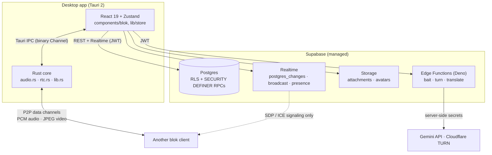
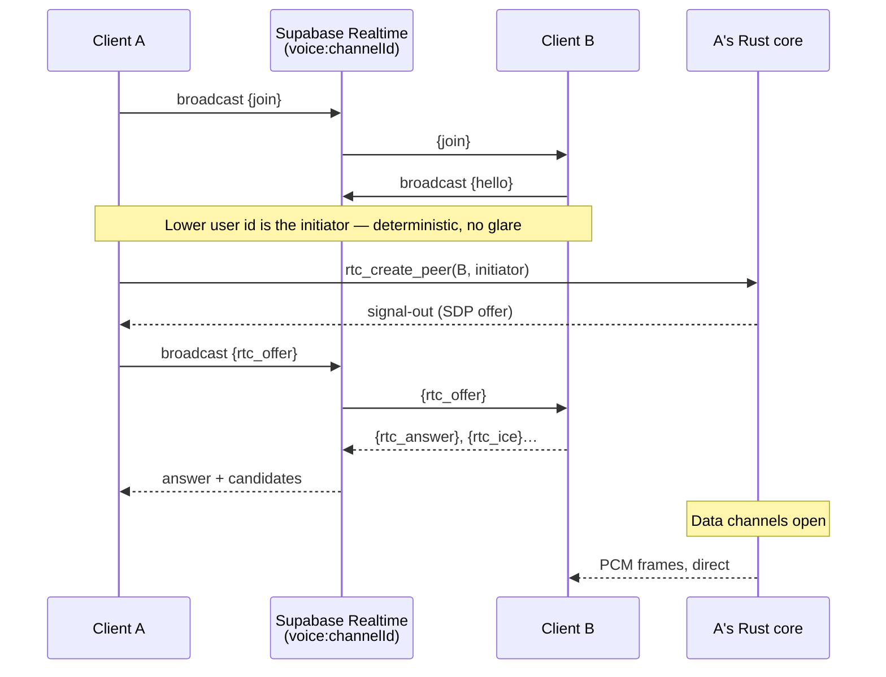
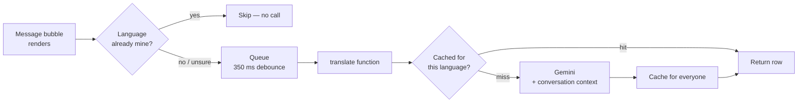
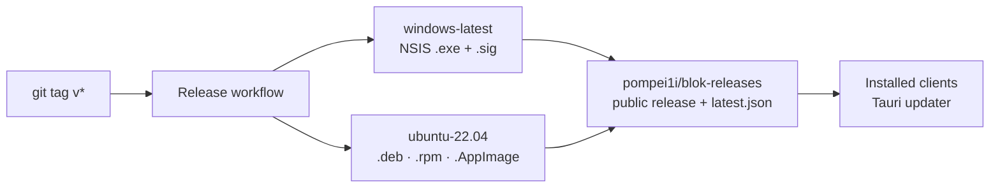

# Architecture

How blok is put together, and why it's put together that way. If you're about to change
something structural, this is the document to read first.

## The shape of it

blok is a desktop app with no application server of its own. The client talks straight to
Supabase for state, and straight to other clients for media.



Two things follow from that picture, and most design decisions in the codebase come back
to them:

1. **There is no trusted middle tier.** The client is hostile by assumption. Every rule
   that matters — who can read a channel, who can ban, how many coins a loot box pays —
   is enforced in Postgres, not in TypeScript.
2. **Media never touches the server.** Voice and video are peer-to-peer. Supabase only
   carries the handshake.

## Desktop client

```
desktop/src/
├── components/blok/     # Every screen and widget (chat, voice, settings, modals)
├── lib/
│   ├── store/           # Zustand — the single source of truth for domain state
│   │   ├── slices/      # server-store is split: messages, polls, servers, voice
│   │   ├── dm-store.ts  # DMs are separate: different tables, different RLS
│   │   └── …            # auth, friends, economy, quests, bait, translation, toasts
│   ├── native-voice-engine.ts   # Orchestrates the Rust transport + signaling
│   ├── bait-tools.ts    # Tool definitions the AI assistant can call
│   ├── i18n.ts          # 6 locales, flat key namespace
│   └── translation.ts   # Language guessing for auto-translate
├── hooks/
└── locales/             # en · ru · uk · pl · de · es — identical key sets, enforced by tests
```

**State lives in stores, never in components.** `server-store` is assembled from slices
(`message-slice`, `poll-slice`, `server-slice`, `voice-slice`) because it grew past what
one file should hold, but it stays a single store so cross-slice reads don't need
plumbing. Components subscribe with selectors; anything a component computes from store
data should be cheap enough to run on every render.

**Realtime subscriptions are set up once**, in the store, not per component — see
`initMessageRealtime` in [`message-slice.ts`](../desktop/src/lib/store/slices/message-slice.ts).
Message inserts arrive as `postgres_changes` events and are merged optimistically: the
sender adds its own message immediately and the realtime echo is de-duplicated by id,
because the two can arrive in either order.

## The native layer

Three Rust modules, all in [`desktop/src-tauri/src/`](../desktop/src-tauri/src/):

| Module | Owns |
|---|---|
| `audio.rs` | cpal capture/playback at 48 kHz, 40 ms frames, noise suppression, echo cancellation, noise gate, per-peer jitter buffers (~150 ms), speaking detection |
| `rtc.rs` | webrtc-rs peer connections carrying **data channels only** — the entire P2P transport |
| `lib.rs` | Tauri commands, screen capture (SIMD JPEG encoding), system tray, auto-updater, window plumbing |

**Why the transport is native rather than browser WebRTC:** Ubuntu's and Mint's system
WebKitGTK is compiled without WebRTC — `RTCPeerConnection` simply doesn't exist there, so
a browser-side implementation can never work on Linux. Moving peer connections into Rust
made one code path that runs identically on Windows and Linux.

Per peer there are two data channels, tuned to what they carry:

- **`audio`** — unordered, `max_retransmits: 0`. A voice frame that arrives late is worse
  than one that never arrives.
- **`video`** — unordered but *reliable*. A JPEG frame is 30–200 KB and fragments into many
  SCTP chunks; with retransmits off, one lost chunk destroys the whole frame. Staleness is
  handled by a sequence header on the receiver and a drop-oldest queue on the sender.

Frames cross the JS/Rust boundary over a binary Tauri `Channel`, not JSON IPC — a
serialized PCM buffer per 40 ms would be absurd.

### Joining a voice channel



TURN credentials for peers behind strict NAT are minted per session by the
[`turn`](../supabase/functions/turn/index.ts) Edge Function, so no static relay secret
ships in the binary.

## Backend

The database *is* the backend. There are 46 idempotent migrations in
[`supabase/migrations/`](../supabase/migrations/) and no migration-tracking table: the
whole folder is replayed in filename order, which is why every file must be safe to run
twice. The discipline is documented in
[`supabase/migrations/README.md`](../supabase/migrations/README.md).

**Row-Level Security is on everywhere.** Membership checks funnel through helpers —
`is_channel_member(channel_id)`, `is_server_member(server_id)`, `has_server_perm(server_id, bit)`
— so a policy is one line and the rule lives in exactly one place.

**Anything a client must not be able to fake goes through a `SECURITY DEFINER` RPC**, with
clients holding only `SELECT` on the underlying tables:

| RPC | Why it can't be client-side |
|---|---|
| `open_loot_box` | RNG and the two-tier pity counter must not be observable or forgeable |
| `buy_item`, `equip_item` | Price and ownership checks |
| `claim_quest_reward` | Server-validated progress |
| `join_server_by_invite`, `invite_member`, `kick_server_member`, `assign_member_role` | Permission checks the client shouldn't be trusted with |
| `create_server`, `delete_server`, `delete_channel_cascade` | Multi-table writes that must be atomic |
| `bait_rate_check`, `translate_rate_check` | Rate limits enforced against `auth.uid()` |

Permissions are a bitfield on roles; `has_server_perm` short-circuits for the owner.

### Edge Functions

Three Deno functions, each existing for the same reason: a secret that must not ship in a
public binary.

| Function | Purpose |
|---|---|
| [`bait`](../supabase/functions/bait/index.ts) | The AI assistant. Accepts Anthropic-shaped requests and translates them to Gemini's OpenAI-compatible endpoint, so the client's tool-use loop stays provider-agnostic. Per-user rate limits, forced cheap model, token cap. |
| [`turn`](../supabase/functions/turn/index.ts) | Mints short-lived Cloudflare TURN credentials for authenticated users. |
| [`translate`](../supabase/functions/translate/index.ts) | Batch message translation with a shared cache. |

### How auto-translation works

Worth its own section, because it's the most cost-sensitive path in the app.



Four things keep the bill down and the quality up:

- **The bubble asks for itself.** Requests originate in the message component, so every
  text surface (channels, DMs, group DMs, pins) is covered by one implementation — and
  because the channel list is virtualized, only messages actually on screen ever cost
  anything.
- **A client-side guess skips same-language messages** before any network call
  ([`translation.ts`](../desktop/src/lib/translation.ts)). It is deliberately asymmetric:
  when unsure it returns `null` and lets the message through, because a needless call is
  cheaper than silently withholding a translation.
- **The cache is shared across users**, keyed by `(scope, message_id, target_lang)`. The
  first reader of a message pays; everyone else in the channel reads the row. Reading it
  requires being able to read the underlying message — the RLS policy mirrors the message's
  own visibility.
- **The client sends ids, never text.** The function reads message content from the
  database under the caller's own RLS, so arbitrary ids can't be used to translate — or
  exfiltrate — someone else's messages.

Accuracy comes from context, not from a bigger model: the prompt gets the preceding
messages of that conversation plus each author's pronouns, which is what makes gendered
forms and ellipsis survive translation into Slavic languages.

## Security model in one page

- **Client secrets:** only the Supabase anon key, which is useless without a session
  because RLS gates every table. Anthropic/Gemini keys and Cloudflare TURN tokens live as
  Edge Function secrets.
- **Authorization:** RLS policies + `SECURITY DEFINER` RPCs. No permission check that
  matters exists only in the front-end.
- **Content limits and rate limits** are database triggers, not client validation
  (`20260702_content_limits_rate.sql`).
- **The updater** verifies a minisign signature against a public key baked into
  `tauri.conf.json`; the private key lives only in GitHub Actions secrets. See
  [`SIGNING.md`](SIGNING.md).
- **CSP** is set in `tauri.conf.json` — no remote scripts, ever.

## Build and release



Build-time env vars (Supabase URL/anon key, Tenor key, TURN fallback) come from repository
secrets, so a fork builds against its own backend by setting its own secrets. Release
artifacts are published to a **separate public repository** (`blok-releases`) and
`latest.json` URLs are rewritten to point at it, which keeps download traffic and the
updater feed off the source repo.

## Adding a feature: the well-worn path

1. **Migration first** — table, RLS policies, and an RPC if the write needs privileges.
   Idempotent, or it doesn't merge.
2. **Store slice** — actions that call Supabase, plus a realtime subscription if other
   clients need to see it happen.
3. **Component** — reads the store through selectors, owns no domain state.
4. **i18n** — every string in all six locales; `npm run i18n:check` will tell you what you missed.
5. **Tests** — Vitest around the store logic and any pure helper.
